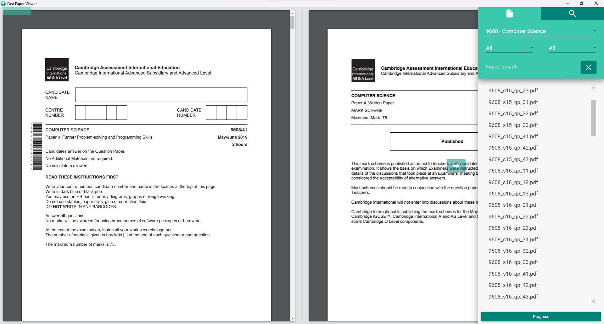
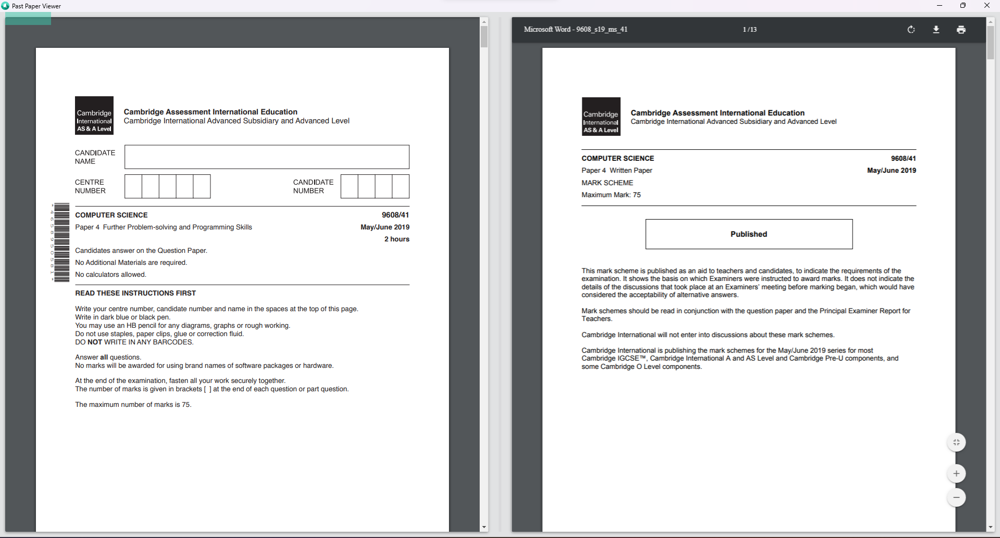
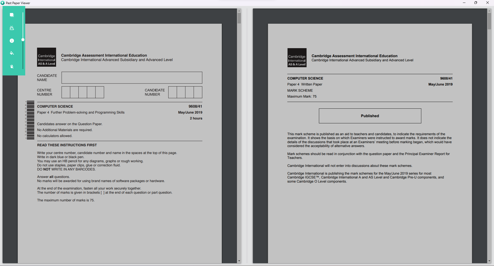

# 📝 Past Paper Viewer | Your best A-Level Revision Companion
This is actually a relic from the past, as it was made way back in 2019-2020 for my high school peers. Luckily I found the original source code and, to my surprise, found out that it still works so I want to upload this for archival purposes.

## Key Features
1. **Side-by-side View of Questions and Answers** - no need to open another window to verify answers.
2. **Open Random Paper** - randomized papers so you can remember the information for longer.
3. **Automatic Software & Database Update** - everytime I release an update or my script scrapes a new set of papers (which automatically uploads to DropBox), users will get a dialog to update their software or paper database.
4. **Flexible Search Options** - a set of search options using different sets of brackets `(), {}, []` is incorporated to optionally give users more power over their searches.
5. **Automatic PDF Scanning** - usage of the iTextSharp API to automatically scan text images (OCR) and enable searching. Some common scan mistakes are also looked for in the code and fixed accordingly.

## Building and Usage
### Pre-built Binaries
1. Check the "Releases" tab
2. Unzip and open "PastPaperViewer.exe"

### Build from Source
1. Clone the repo
2. Either open the `.csproj` file in Visual Studio, or open the folder in VSCode and, with the `C# Dev Kit` extension, use the `.NET: Build` command.

## Showcase

Default Layout - to the right is the panel to change the period of papers, a randomizer and a search bar.
 

Default Layout with Right Panel Collapsed - question paper (left) and answer key (right)

User Options Panel (top left) - dim viewer (for night view), toggle answer key, change UI color, reset all

## Technologies Used
- This project uses C# for its backend and WPF (XAML) for GUI.
- Material Design In XAML Toolkit
- iTextSharp API for performant PDF post-processing
- Rebrandly for Custom URL redirection, and DropBox for file hosting.
